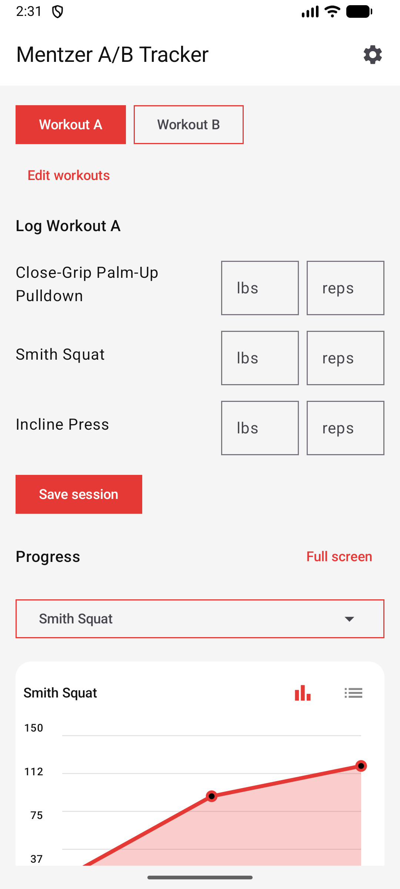
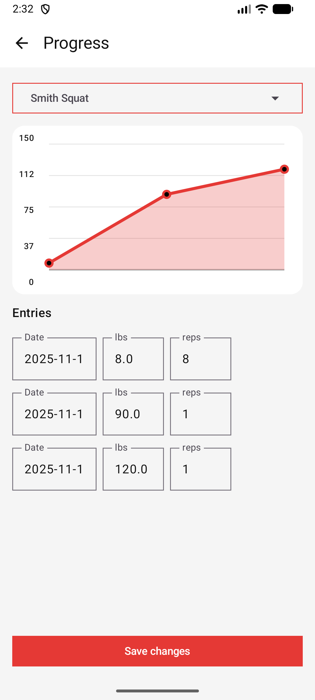

# MentzerTracker

MentzerTracker is a simple Android app for planning and logging Mike Mentzer style A/B workouts. Built this for personal workout usage.

## Features
- Quick logging for weight and reps
- Light and dark theme
- Data reset option for a fresh start
- Customizable workout notifications (Daily, Weekly, or custom intervals) to keep you on track.
- Smart workout logic notifications (tells you if it's time for Workout A or B).

## Screenshots

<p align="center">
  
  
</p>
<p align="center">
  
  
</p>

## Building

1. **Clone the repo**
   ```bash
   git clone https://github.com/<your-org>/MentzerTracker.git
   cd MentzerTracker
   ```
2. **Open in Android Studio** (Giraffe or newer recommended).
3. **Sync & Build** – Android Studio will download dependencies via Gradle.
4. **Run** on an emulator or physical device running Android 11.0 or higher.
